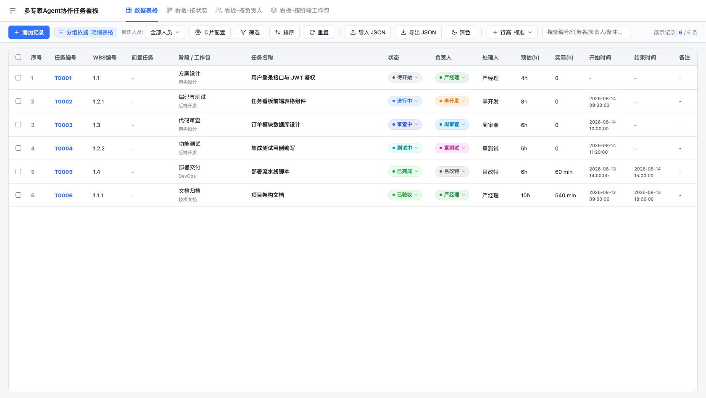

# Multi-Agent Team Workflow (多专家协同研发工作流)

> 契约驱动的多角色 Agent 协同研发技能包 —— 将项目管理、架构、开发、审查、测试、文档、运维拆分为 8 大专家角色，以五层防错门控 + 看板自动化流转，消除跨角色越权、打回碎片化与状态悬挂。

解耦、高可靠、具备防错闭环机制的 AI 多专家协同研发工作流技能包：状态与处理人原子绑定、打回不拆单、报告复验追加、多专家并发安全落卡，让 AI 团队协同严丝合缝。

## 看板界面



## 快速使用（Agent 初始化）

**前置要求**：任一支持 Markdown/Skill 规范的 AI Agent（Antigravity CLI / Codex / Claude Code / Cursor 等）；使用离线本地看板**无需任何凭证**。

1. 将技能包安装到项目 `.yy-flow/skill`（推荐 degit / tarball，天然不带 `.git`）：

```bash
cd /path/to/your-project

# 方式 A: degit（需本机 Node，固定版本用 #release_v6，跟默认分支则省略）
npx -y degit YuanYii/multi-agent-flow#release_v6 /tmp/yy-flow-stage && mkdir -p .yy-flow && mv /tmp/yy-flow-stage .yy-flow/skill
# 注: degit 要求目标目录为空/不存在，故先落临时目录再就位

# 方式 B: tarball（无 Node 环境，零依赖）
mkdir -p .yy-flow/skill && curl -L https://github.com/YuanYii/multi-agent-flow/archive/refs/heads/release_v6.tar.gz | tar xz -C .yy-flow/skill --strip-components=1
```

安装后布局（数据与技能同根，升级删 `.yy-flow/skill` 重装不伤数据；`docs/` 是项目交付物留项目根）：

```text
<project>/
├── .yy-flow/            # 工具私有（建议整体加入 .gitignore）
│   ├── skill/           # 技能代码
│   └── user_data/       # 初始化后生成：board/审计/锁
└── docs/                # 项目文档骨架（交付物，提交 git）
```

<details>
<summary><b>多项目共享安装（可选，单份正本 + 各宿主全局软链）</b></summary>

多项目共用一份只读正本，避免每项目重复拷贝与版本漂移：

```bash
# 一次性安装（Linux/macOS；Windows 用 scripts/install_global.ps1）
bash scripts/install_global.sh            # 正本落 ~/agent-skills/multi-agent-flow
# 或固定版本: bash scripts/install_global.sh release_v6
```

安装器会：
1. 物化正本至 `~/agent-skills/multi-agent-flow`（degit 优先、tarball 兜底）；
2. **零数据守卫**：正本内含 `user_data/board.json` 即拒绝安装（防数据串写）；
3. 写入 `.yy-flow-shared` 标记（数据根解析据此永不做 legacy 误判）；
4. 运行 `verify_and_export_agents.py --global` 软链至各已安装宿主的用户级技能目录（如 `~/.claude/skills/yy-flow`）。

共享模式下的数据边界：
- **代码共享**：scripts/kanban/templates/references 等只读资产一份；
- **数据隔离**：每个项目的 `user_data/`、锁文件落各自项目根（解析链：`YY_FLOW_PROJECT_ROOT` > `.yy-flow` 自定位 > CWD）；
- 各项目仍需各自执行一次 `/yy-flow start` 初始化（生成项目专属配置与看板）；
- 更新技能 = 重跑安装器；卸载 = 删各宿主软链 + 正本目录。

</details>

<details>
<summary><b>存量安装迁移到 .yy-flow 布局（可选）</b></summary>

旧版 `skills/multi-agent-flow/` 内嵌安装无需迁移（legacy 兼容，行为不变）。想切换到新布局：

```bash
mkdir -p .yy-flow && mv skills/multi-agent-flow .yy-flow/skill
mv .yy-flow/skill/user_data .yy-flow/user_data   # 若存在
```

</details>

2. 在与 Agent 的对话中触发初始化（二选一）：

- 输入快捷指令 **`/yy-flow`** 或 **`/yy-flow start`**
- 或直接说：**“使用 multi-agent-flow 初始化当前项目”**

3. Agent 将自动执行 7 步标准初始化：

| 步骤 | 动作 |
| :--- | :--- |
| 1 | 敏感凭据扫描（`check_secrets.py`），确保零密钥泄露 |
| 2 | 按宿主 Agent 规范导出 8 大专家子代理至 `.agents/agents/` |
| 3 | 技术架构物理扫描（`auto_scan_stack.py`）识别语言/框架 |
| 4 | 生成宿主专属 `user_data/`（workflow 配置、board.json、审计日志） |
| 5 | 建立 `docs/` 工程文档骨架并归档历史散落文档 |
| 6 | 专家团队技术栈自动同步（`agents/*.yaml`） |
| 7 | 唤起 PM 严经理，输出项目鉴定与 8 大专家权限矩阵 |

初始化完成后即可开始流转，后续无需重新初始化。

## 常用快捷指令

| 指令 | 功能 |
| :--- | :--- |
| **`/yy-flow`** 或 **`/yy-flow start`** | 一键激活工作流：初始化 SOP + 唤起 PM |
| **`/yy-flow status`** | 看板巡检：输出流转状态、在手任务与滞留告警 |
| **`/yy-flow kanban`** | 启动离线看板 Web 服务（默认 32886，被其他项目占用自动递增，同项目复用）并输出实际访问链接 |
| **`/yy-flow metrics`** | 研发效能度量：Lead Time、吞吐量与卡点分析 |
| **`/yy-flow create`** | 显式建单：创建任务卡【待开始】并分配处理人（PM 可派发任意，非 PM 仅可自建） |
| **`/yy-flow auto`** | 自动任务：一条指令完成完整生命周期至已验收（全类型链、任意节点续跑、阻断前置验证） |

## 任务流转（Agent 对话示例）

| 场景 | 示例 Prompt | 结果 |
| :--- | :--- | :--- |
| 自领取任务 | “使用 multi-agent-flow，自领取下一个待开始任务” | 核验并发上限（≤3）→ 置【进行中】→ 开始编码 |
| 提交审查 | “提交 T0001 代码审查” | 状态【审查中】，处理人移交 Reviewer |
| 审查/测试 | “审查 T0001” | 通过→【测试中】/【已完成】；不通过→【已退回】回原负责人，备注写入 `DEF-T0001-1`（不拆单） |
| 验收 | “验收已完成任务” | PM 校验结束时间 →【已验收】 |
| 启动看板 | “启动看板” | 输出实际端口访问链接（默认 <http://localhost:32886/>，多项目并行自动递增） |

## 核心能力

- **五层防错门控**：角色权限 / 特权放行 / 越权硬阻断 / 防自环死锁 / 并发上限与终态冻结，Fail-Closed 物理拦截。
- **流程节点双标识**：每次流转在卡片 `process` 追加 `[{时间}] [{T0001-N03}] [{角色}] 状态由…更新至…` 节点行；节点号锁内 `max+1` 分配、单调递增、回滚烧号不复用，时间线按节点号升序渲染（历史旧行兼容排前）。
- **原子强绑定**：状态流转必须同步移交处理人；打回一律原单退回并追加结构化缺陷，禁止派生孤儿任务与碎片报告。
- **并发安全**：全局排他锁（`board.json.seq.lock`）+ 临时文件原子替换，多专家并发建单编号 100% 不重复。
- **看板双模**：纯静态离线（双击 `kanban/offline_board.html` 即用，localStorage 持久化）/ 本地 HTTP 服务（实时强同步 `user_data/board.json`）。
- **在线看板扩展（可选）**：配置 `user_data/workflow.config.yaml` 可切换飞书 Base / Jira / GitHub Projects。
- **体验细节**：自动日落护眼主题、终态优先流转标签、多维筛选与排序。
- **防重复建单**：建卡时对最近 N 条任务做名称重复度校验（完全一致/包含/相似度≥阈值），命中即终止并提示，用户确认后以 `--force` 重跑；`N` 与阈值在 `config/workflow.config.yaml` 的 `duplicate_check` 节配置（默认 limit=10、threshold=0.8）。

## 目录结构

```text
.yy-flow/skill/              # 技能代码（安装位置）
├── SKILL.md                 # 技能主入口（/yy-flow 规范与 Prompt）
├── README.md                # 本说明文档
├── rules/                   # 协作契约与防错规则（AGENTS/IDENTITY/SOUL/TOOLS/USER/HEARTBEAT）
├── agents/                  # 8 大专家角色 YAML 定义
├── kanban/                  # 离线看板（offline_board.html + js/css/json）
├── config/                  # 工作流与架构配置模板
├── references/              # 6 大参考规约（流转/防错/Git/文档/交接）
├── templates/               # 标准化报告与文档模板
└── scripts/                 # 初始化/流转/度量/看板服务等 CLI 引擎

# 初始化后生成（数据根 = .yy-flow，与 skill 同根；升级删 .yy-flow/skill 重装不伤数据）：
.yy-flow/user_data/
├── board.json               # 任务工单真实数据
├── workflow.config.yaml     # 宿主工作流配置
├── project_architecture.config.yaml
├── locks/                   # 任务并发锁文件
└── logs/                    # 审计流转日志

# 项目交付文档（留项目根，提交 git）：
docs/                        # 01-architecture ~ 05-templates 五分类骨架

# 兼容：存量 skills/multi-agent-flow/user_data 内嵌安装零迁移，行为不变
```

## 更多文档

- [技能主入口 SKILL.md](SKILL.md) — 快捷指令、初始化 SOP 与动态流转协议
- [AI 团队工作流索引](references/01-AI-Team-Workflow-Index.md) — 角色职责与流转总览
- [防错闭环机制](references/03-Anti-Error-Mechanism.md) — 五层门控与守护原则
- [状态流转规则](references/02-State-Flow-Rules.md) — 8 状态定义与 A-G 任务类型
- [规则契约 rules/](rules/) — 协作红线与巡检协议

## License

MIT
