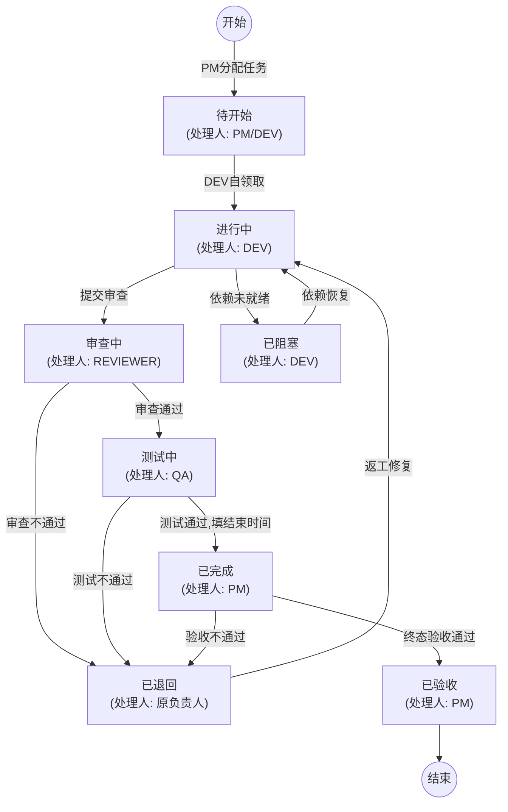

# Multi-Agent Team Workflow (多专家协同研发工作流)

> 契约驱动的多角色 Agent 协同研发技能包 —— 消除跨角色越权、打回碎片化与状态悬挂，让 AI 团队协作严丝合缝。

解耦、高可靠、具备防错闭环机制的 AI 多专家协同研发工作流技能包。基于成熟的软件工程实践，将项目管理、系统架构、代码开发、代码审查、功能测试、技术文档与 Git/运维整理解耦为 7 大标准职能角色，提供防错门控、打回不拆单、报告复验追加与看板自动化流转等能力。

---

## 快速使用

### 前置要求

- 任一 AI Agent：Antigravity CLI / Codex / Claude Code / Cursor / 或其他支持加载 Markdown 规范的 Agent
- (可选) 在线看板凭证：飞书 Base / Jira / GitHub Projects（使用**离线本地看板**则完全无需任何凭证）

### 安装

将本 Skill 包克隆或复制到项目或 AI Agent 技能目录下：

```bash
cd /path/to/your-project

# 克隆技能包到 skills 目录
git clone --depth 1 https://github.com/YuanYii/multi-agent-flow.git skills/multi-agent-flow && rm -rf skills/multi-agent-flow/.git
```

### 项目初始化与架构识别

您可以直接指令 Agent（如输入 `“使用 multi-agent-flow 初始化当前项目”`）为您完成所有初始配置，无需手动执行文件复制或系统架构分析操作。

1. **技术架构自动识别与 Token 消耗提示**：当 Agent 初次在项目中调阅本 Skill 时，系统架构分析与识别工作可直接交由 Agent 自动执行。它将自动输出初始化通知及 Token 消耗提醒（说明全面扫描工程配置的过程**会消耗较多 Token**）。
2. **Subagent 官方标准路径实时查证与挂载**：识别当前运行环境后，严格查阅对应 Agent 官方最新文档（如 Antigravity 的 `{workspace}/.agents/agents/{agent_name}/agent.md` 与 `subagent: true` 标头），运行 `python3 scripts/export_agent_adapters.py` 将 7 大专家精准挂载放置于官方原生支持的路径下。
3. **读取模板生成配置**：读取 [`config/project_architecture.template.yaml`](config/project_architecture.template.yaml) 模板生成并落库 `config/project_architecture.config.yaml`。
4. **项目工程文档骨架建立与原项目文档自动归档**：Agent 将自动在项目中校验/创建标准的 `docs/` 目录树骨架，自动运行 `python3 scripts/migrate_legacy_docs.py` 扫描原项目散落的历史文档，并在对应的分类下自动创建 **`原项目文档/`** 子目录进行拷贝归档与隔离，并在 `.gitignore` 中追加 `.drafts/` 隔离规约。
5. **专家团队技术栈自动同步**：自动运行 `python3 scripts/update_agent_tech_stacks.py`，将扫描到的技术栈同步落盘至 `agents/*.yaml` 配置文件。
6. **唤起 PM 鉴定项目并输出声明**：自动触发 PM 角色扫描当前项目 `README.md` 和源码，并在回复中显式输出：**`【已识别 xxxx 项目】`** 标识及使用指引。

### 🔌 连接数据看板的必要信息与凭证指南（在线 / 离线）

在将 Agent 与线上数据看板建立连接时，需在 [`config/workflow.config.yaml`](config/workflow.config.template.yaml) 及系统环境变量中配置以下必备 API 鉴权与连接参数：

#### 1. 飞书多维表格 (Feishu Base) —— 推荐
- **配置文件参数** (`config/workflow.config.yaml`)：
  - `board.provider`: `"feishu_base"`
  - `board.base_token`: **Base Token**（多维表格浏览器 URL `https://feishu.cn/base/【Base_Token】?table=...` 中 `base/` 后方的字符串）
  - `board.table_id`: **Table ID**（多维表格 URL `...table=【tbl_ID】` 中 `table=` 后方的字符串）
- **系统环境变量凭证**（API 授权使用）：
  - `FEISHU_APP_ID`: 飞书开放平台自建应用的 App ID（示例：`cli_a1b2c3d4e5`）
  - `FEISHU_APP_SECRET`: 飞书开放平台自建应用的 App Secret 密钥

#### 2. Jira 看板
- **配置文件参数**：
  - `board.provider`: `"jira"`
  - `board.domain`: Jira 实例域名（示例：`https://your-domain.atlassian.net`）
  - `board.project_key`: 项目 Project Key（示例：`PROJ`）
- **系统环境变量凭证**：
  - `JIRA_USER_EMAIL`: Atlassian 账号邮箱
  - `JIRA_API_TOKEN`: Atlassian 账号后台生成的 API Token

#### 3. GitHub Projects (v2)
- **配置文件参数**：
  - `board.provider`: `"github_projects"`
  - `board.owner`: GitHub 组织名或用户名
  - `board.project_number`: Project 编号（示例：`1`）
- **系统环境变量凭证**：
  - `GITHUB_TOKEN`: 具备 `repo` 和 `project` 读写权限的 Personal Access Token (PAT)

#### 4. 离线本地看板 (Local JSON) —— 零依赖，开箱即用

无需任何 API 凭证与网络，数据存储于本地 JSON 文件（与 [multiagent-kanban](https://github.com/YuanYii/multiagent-kanban) 离线看板格式互通，支持浏览器拖拽流转）：

- **配置文件参数** (`config/workflow.config.yaml`)：
  - `board.provider`: `"local"`
  - `board.board_file`: 看板 JSON 文件路径（示例：`kanban/board.json`）
  - `board.fields`: 字段名映射（完整示例见 [`config/workflow.config.template.yaml`](config/workflow.config.template.yaml)）
- **无需任何环境变量凭证**

**专家流转自动落卡**：调用 `transition_task.py` 执行流转时，若任务在看板中不存在将自动创建（初始状态「待开始」）后再流转，**7 大专家角色均可操作**：

```bash
# 首次使用：初始化空看板文件
python3 scripts/offline_board_adapter.py --init kanban/board.json

# 专家流转：任务不存在自动创建；省略 --task-id 时自动分配最大编号+1
python3 scripts/transition_task.py --config config/workflow.config.yaml \
  --role PM --from-status 待开始 --to-status 进行中 --assignee Dev_User_1 \
  --task-name "新任务" --stage "S1" --wp "WP-1"

# 查看看板任务
python3 scripts/offline_board_adapter.py --list kanban/board.json
```

**并发安全编号分配**：多个专家并发新建任务时，任务编号（`T\d+` 取最大号 +1）由适配器**全局排他锁**（`board.json.seq.lock`）串行分配，**编号 100% 不重复**；文件写入采用临时文件 + 原子替换（`os.replace`），杜绝半写文件；显式指定编号重复时 Fail-Closed 拒绝创建。

**人工查看与拖拽**：使用配套离线看板 UI（[multiagent-kanban](https://github.com/YuanYii/multiagent-kanban)，零依赖 HTML 应用），通过「导入 JSON」加载 `kanban/board.json` 浏览与拖拽流转，操作后「导出 JSON」覆盖回文件，即可与 Agent 流转双向同步。

---

### 任务流转与指令交互

在与 Agent 对话时，只需在 Prompt 中唤起 `multi-agent-flow` 技能标识，或在支持子 Agent 命令的 IDE 中直接使用快捷语法（如 `@flow-dev`, `/flow-dev`），Agent 将自动调阅 `SKILL.md` 并动态加载 `rules/` 下的核心规则与防错契约：

#### 1. 开发人员自领取任务
> **“使用 multi-agent-flow，自领取下一个待开始任务”** （或直接在对话中召唤 `@flow-dev` / `/flow-dev`）

```text
→ Agent 自动核验并发上限 (≤3) 与领用顺序 (按编号从小到大)
→ 先将看板状态置为【进行中】，确认成功落库后再启动编码
```

#### 2. 开发完成提交审查
> **“使用 multi-agent-flow，提交 T0001 代码审查”** （或召唤 `@flow-reviewer` / `/flow-reviewer`）

```text
→ 自动撰写/更新开发任务报告 (按工作包归档)
→ 原子级更新看板状态为【审查中】，处理人移交【Reviewer】
```

#### 3. 审查与测试通过/打回
> **“使用 multi-agent-flow，审查 T0001”** （或召唤 `@flow-qa` / `/flow-qa`）

```text
→ 若审查通过：状态推至【测试中】，处理人移交【QA】
→ 若审查不通过：打回原任务，状态变【已退回】，处理人改回【原负责人】
  并在看板「备注」中结构化写入 DEF-T0001-1 缺陷信息（不派生新任务编号）
```

#### 4. 项目经理验收
> **“使用 multi-agent-flow，验收已完成任务”** （或召唤 `@flow-pm` / `/flow-pm`）

```text
→ 检查结束时间强校验，状态更新为【已验收】，末处理人保持【PM】
```

---

## 📜 核心契约与防错规则 (`rules/`)

技能包在 [`rules/`](rules/) 目录下内置了全套标准化交互契约与防错规则，在调用 Skill 时自动按需装载：

- 🚩 [`rules/AGENTS.md`](rules/AGENTS.md)：**多专家团队协作契约** —— 规定 6 大协作红线、看板状态不变量与动态按需加载协议。
- 🎭 [`rules/IDENTITY.md`](rules/IDENTITY.md)：**专家团多面人设与身份契约** —— 定义 PM、ARCHITECT、DEV、REVIEWER、QA、DOCS、DEVOPS 7 大专家身份及其提权代行规约。
- ⚡ [`rules/SOUL.md`](rules/SOUL.md)：**行为原则与防错控制心脏** —— 规定事实高于推论、原子更新、缺陷溯源不切碎等安全控制核心。
- 💓 [`rules/HEARTBEAT.md`](rules/HEARTBEAT.md)：**看板状态巡检与卡顿监控** —— 规定滞留任务、并发上限及状态处理人一致性等巡检 Checklist。
- 🛠️ [`rules/TOOLS.md`](rules/TOOLS.md)：**看板与工程工具链指引** —— 描述 `init_field_mapping.py`、`feishu_base_adapter.py` 等脚本说明。
- 🤝 [`rules/USER.md`](rules/USER.md)：**用户交互协议与协同契约** —— 规定自领取筛选规则、跨角色提权代行交互及打回确认流程。

---

## 为什么需要多专家协同规范？

在多 Agent 或 AI 与人类团队协同研发中，常见痛点：

- **乱越权改看板**：开发 Agent 自作主张把任务改成“已验收”，导致未经过测试的代码直接上产线。
- **打回派生孤儿任务**：代码审查不通过就新建 `T0103-fix` 等碎片任务，导致上下文断裂、历史不可追溯。
- **报告满天飞**：每次复审复测都新建《XXX_复审报告2.md》，文档严重离散。
- **状态与处理人不同步**：只改了状态为“审查中”，但处理人忘记改，导致下游角色看不到任务（任务悬挂）。

`multi-agent-flow` 将软件工程的严肃协同纪律融入 Agent 交互协议中 —— **不是限制 AI，而是确保 AI 团队协同严丝合缝**。

---

## 核心架构与 7 大抽象角色

每个节点由独立的专家角色（Role Agent）执行，详尽信息可参考 [`references/01-AI-Team-Workflow-Index.md`](references/01-AI-Team-Workflow-Index.md)。以下为各角色核心职责与红线边界：

- **PM（项目经理）**：负责 WBS 维护、工作包拆解、任务派发与最终阶段验收。
  - *红线*：不编写业务代码、不做技术架构设计、不亲自跑单测/集成测试。
- **ARCHITECT（系统架构师）**：负责系统架构设计、技术选型与 ADR 编写。
  - *红线*：架构设计不等于代码实现，任务完成后直接交由 PM 验收。
- **DEV（开发工程师）**：负责 Schema 定义、业务编码、单测（覆盖率>80%）及环境治理。
  - *红线*：并发上限3个任务，必须先将看板状态改为“进行中”再开始编码。
- **REVIEWER（代码审查员）**：负责代码规范 (PEP8 / Clean Code)、安全漏洞扫描与性能评估。
  - *规范*：审查报告需标注问题优先级，打回时需回写结构化缺陷信息。
- **QA（测试工程师）**：负责集成测试、端到端系统测试、回归测试。
  - *红线*：不做单元测试。测试通过时必须在看板中填入结束时间。
- **DOCS（文档工程师）**：负责平台操作手册、API 帮助文档等。
  - *特例*：文档任务走精简流转，无需代码审查与测试。
- **DEVOPS（运维管理员）**：负责分支合并、打 SemVer 标签与环境编排。
  - *触发*：当前阶段任务全验收后由 PM 触发。

---

## 任务生命周期与状态流转

本工作流包含 8 个标准状态：`待开始`、`进行中`、`审查中`、`测试中`、`已退回`、`已阻塞`、`已完成`、`已验收`。
详细状态定义与退回规则可参考 [`references/02-State-Flow-Rules.md`](references/02-State-Flow-Rules.md)。

### 常规开发任务（A类）标准流转链：



### 其他类型任务流转：
- **架构设计（B类）/ 文档（C类）/ 运维（D类）/ 环境（G类）**：通常直接由 `进行中` 流转至 `已完成` 交由 PM 验收，跳过代码审查与测试环节。

### 核心防错：打回不拆单与报告追加原则
- **严禁派生孤儿任务**：当审查或测试不通过时，**禁止新建独立修复任务（如 T0103-fix）**。一律在原任务上修改状态为 `已退回`，并在备注中写入结构化缺陷信息（`DEF-{原任务编号}-{轮次}`）。
- **禁止新建碎片报告**：审查/测试退回修复后，重新流转时的复审/复测结论，强制要求追加在原有审查/测试报告的末尾章节（如 `§8 复审结论`），严禁新建独立的复审/复测报告文件。

---

## 🛡️ 防错闭环机制 (§九 守护原则)

完整五层防错门控、拦截处理与提权代行逻辑详见：
👉 [`references/03-Anti-Error-Mechanism.md`](references/03-Anti-Error-Mechanism.md)

1. **状态与处理人原子绑定 (Atomic Update)**：修改状态必须同步修改处理人。
2. **打回不拆单原则 (Non-Fragmented Defect)**：打回一律在原任务上置为 `已退回` 并追加 `DEF-TXXX-N`。
3. **报告复验追加原则 (Appended Audit)**：复审/复测结论强制追加至原报告。
4. **原项目文档只读归档原则 (Read-Only Legacy Governance)**：归档镜像拷贝入 `docs/*/原项目文档/`，源文件 100% 保持原样，严格禁篡改历史原文档。
5. **五层防错门控 (Anti-Error Protocol)**：路径推导 ➔ 角色门控 ➔ 提权协议 ➔ 指令分派 ➔ 隔离安全。

---

## 📂 目录结构与规范

```text
2_多专家协同研发工作流/
└── multi-agent-flow/                  # [技能核心包]
    ├── SKILL.md                       # 技能主入口指令与 Prompt
    ├── README.md                      # 本说明文档
    ├── rules/                         # [核心规则与契约]
    │   ├── AGENTS.md                  # [核心] 多专家团队 Agent 协作契约与 6 大红线
    │   ├── IDENTITY.md                # [角色] 7大专家 Agent 身份定义与多面人设
    │   ├── SOUL.md                    # [控制] 状态流转防错闭环心脏 (§九)
    │   ├── TOOLS.md                   # [工具] 看板工具与 CLI 适配层使用指引
    │   ├── USER.md                    # [协议] 自领取规则与跨角色提权代行协议
    │   └── HEARTBEAT.md               # [巡检] 看板巡检与状态不变量核验规则
    ├── agents/                        # 7 大专家 Agent YAML 描述 (01-pm.yaml ~ 07-devops.yaml)
    ├── config/                        # 零硬编码配置模板 (workflow.config & project_architecture)
    ├── references/                    # 6 大全量提炼参考规约 (路由/流转/防错/Git/文档管理/交接协议)
    │   ├── 01-AI-Team-Workflow-Index.md
    │   ├── 02-State-Flow-Rules.md
    │   ├── 03-Anti-Error-Mechanism.md
    │   ├── 04-Git-Workflow-Spec.md
    │   ├── 05-Document-Management-Spec.md
    │   └── 06-Inter-Agent-Handover-Protocol.md
    ├── templates/                     # 开发/审查/测试报告与模块设计/排查文档模板
    └── scripts/                       # 动态 Agent 探针 (export_agent_adapters)、旧文档归档 (migrate_legacy_docs) 与看板适配器 (board_adapter_factory / offline_board_adapter)
```

---

## License

MIT
