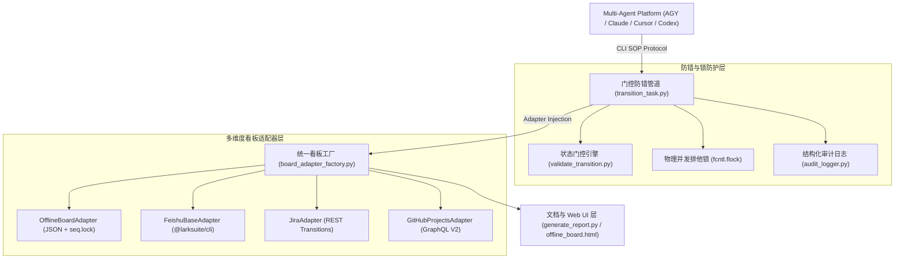

# 🏛️ Multi-Agent Workflow 架构分析与技术要点报告

本报告对多专家协同研发工作流 (`multi-agent-flow`) 进行系统性架构解构与技术要点分析。工作流的核心设计理念为：**以单管 CLI 门控防错机制驱动，严格贯彻物理级 Fail-Closed 原则与状态-处理人原子强绑定**。

---

## 一、 整体架构拓扑 (Architecture Topology)

系统由 **探针导出层**、**门控防错层**、**并发防护锁层**、**多看板适配工厂** 以及 **UI 展示服务层** 5 个逻辑分层构成：

### 1. 探针感知与 Subagent 导出层 (`verify_and_export_agents.py`, `build_agent_context.py`)
- **感知探针**：自动匹配当前 Agent 运行平台（Google Antigravity, Claude Code, Cursor, Codex），支持未知 Agent (如 mimo) 的泛化识别，并在未检测到环境时降级至 `Universal Agent` 标准。
- **角色统一导出**：将 PM, Architect, Dev, Frontend, Reviewer, QA, Docs, DevOps 8 大专家角色生成为符合各平台标准规范的物理 Markdown / MDC prompt 描述文件。

### 2. 状态机与硬门控防错层 (`validate_transition.py`, `transition_task.py`)
- **任务分类矩阵**：支持 A-G 全量 7 类任务（A类常规开发、B架构、C文档、D运维、E自执行、F总结、G环境）。
- **五层防错拦截**：
  1. **角色权限**：禁止跨越角色推动状态；
  2. **特权放行**：对 B/C/D/G 类任务解耦放行从 `进行中` 直接推至 `已完成`；
  3. **越权硬阻断**：物理拦截 DEV/FRONTEND 跨过 Review/QA 提交已完成，拦截 PM 跨推已验收；
  4. **防自环死锁**：打回至 `已退回` 时拦截 Assignee 设置为审查者/测试者自身；
  5. **并发上限与终态冻结**：强制限制 DEV/FRONTEND 在手活动卡片数（`max_parallel ≤ 3`），冻结已验收终态。

### 3. 并发安全与物理锁控制层 (`scripts/transition_task.py`, `audit_logger.py`)
- **双重排他锁**：特定任务采用 per-task 文件锁 (`.lock_{task_id}.lock`)，自动建单 `AUTO` 场景采用全局锁 (`.lock_auto_create_global.lock`)，带超时 300 秒垃圾清理机制。
- **原子补偿回滚**：追加入备注等操作遭遇异常时，自动触发 `rollback_fields` 将看板卡片恢复至原有状态与原处理人。

### 4. 看板统一适配工厂 (`board_adapter_factory.py`)
- **依赖注入**：根据 `workflow.config.yaml` 动态实例化 `OfflineBoardAdapter`, `FeishuBaseAdapter`, `JiraAdapter` 或 `GitHubProjectsAdapter`。
- **离线看板强保障**：`OfflineBoardAdapter` 基于全局 `board.json.seq.lock` 阻塞锁确保读-改-写原子性与增量唯一编号分配 (`T0001` 等)。

### 5. 报告自动化与 Web 服务层 (`generate_report.py`, `start_kanban_server.py`)
- **自动占位符清理**：渲染交付物时清空未替换的元数据占位符，支持无损追加复验记录。
- **零依赖 HTTP 看板**：监听 32886 端口提供轻量级离线 HTML5 看板服务。

---

## 二、 核心技术要点 (Key Technical Aspects)

### 1. Fail-Closed (硬阻断) 原则
系统在任何配置缺失、校验未过、并发竞争失败或环境非法场景下均坚决执行物理硬阻断，直接抛出 `sys.exit(1)` 并记录审计事件，决不进行隐式成功放行。

### 2. 状态与处理人原子强绑定 (Atomic Coupling)
看板状态变化与处理人移交绑定在同一原子 CLI 命令中执行（如 DEV 提交 `审查中` 时必须同步移交给 `周审查`；`已退回` 时强制精准退回原开发者），彻底根除孤儿单与无主任务。

### 3. 双层排他锁机制
- **进程/任务层**：`fcntl.flock(LOCK_EX | LOCK_NB)` 文件独占锁防护；
- **底层数据源层**：`OfflineBoardAdapter` 的 `board.json.seq.lock` 串行化保护。

### 4. 时间差自动解析
`OfflineBoardAdapter._calc_minutes()` 基于 `datetime.fromisoformat()` 解析 ISO 8601 带时区戳字符串（如 `2026-08-11T23:00:00+08:00`），自动在读写时填入 `act_hours` 分钟差（如 `"30 min"`）。

---

## 三、 批判者视角下的架构隐患与中长期演进建议

1. **状态矩阵解耦度**：目前 `ROLE_BASE_PERMISSIONS` 仍写死在 Python 字典中，建议提升至 `config/workflow.config.yaml` 配置文件中定义。
2. **云端 Adapter 异步能力**：Jira/飞书/GitHub 适配器缺少本地缓存与队列（Task Queue），受网络抖动影响较大，中长期建议增加本地异步 Worker 队列。
3. **Web 看板写接口支持**：`start_kanban_server.py` 当前为静态 HTTP 服务，若后续需要支持 Web 拖拽流转，需补充 REST API 端口与 Token 鉴权。
