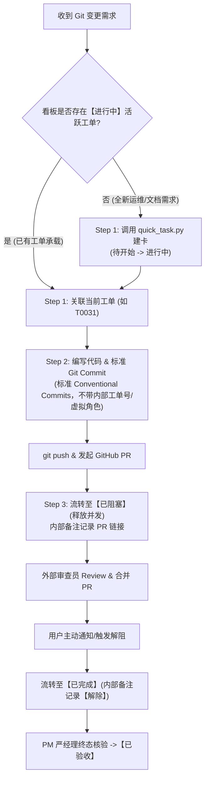

# 04 - Git 分支模型与版本发布规范

> **全规约导航**：[01 主索引](01-AI-Team-Workflow-Index.md) | [02 状态推导](02-State-Flow-Rules.md) | [03 防错机制](03-Anti-Error-Mechanism.md) | [05 文档管理](05-Document-Management-Spec.md) | [06 交接协议](06-Inter-Agent-Handover-Protocol.md)

---

> **本文件说明**：定义软件研发团队的「无工单不 Git」制度、Git 操作与看板任务映射矩阵、PR 生命周期闭环 SOP、分支模型、命名约定与 Commit 提交规范。

---

## 一、「无工单不 Git (No Task, No Git)」与内外隔离原则

在协同研发工作流中，代码仓库变更与看板任务卡生命周期实行**强绑定与内外隔离**：
* **内部强绑定**：任何涉及代码修改、分支推送或 PR 发起的操作，内部必须有且仅有明确的看板工单承载；
* **外部纯净化（内外隔离）**：**外部 Git Commit Message、PR 标题与 PR 正文中严禁出现内部任务编号（如 T00xx、[Task: T00xx]）及内部虚拟角色人名（如李开发、严经理、周审查等）**；所有工单与代码的关联关系，一律通过在**内部看板备注（remarks）与 process 节点中单向记录 Commit SHA 和 PR 链接**来实现追溯。

### 铁律三不准：
1. **不准脱单 Commit**：内部必须有明确的看板工单承载，严禁无卡盲改；
2. **不准外部泄露内部元数据**：Commit Message 与 PR 内容中禁止携带任何内部工单号与虚拟角色名称，保持提交历史专业干净；
3. **不准孤儿 PR / 外部交互**：创建 PR、合流 PR 或在 GitHub PR 发布说明，必须在内部看板备注与 process 节点中回填 PR 链接以形成闭环。

---

## 二、Git 操作与看板任务类型映射矩阵 (Action Mapping)

为防止 Agent 与团队成员混淆任务性质，建立确定性的标准映射：

| Git 操作场景 | 典型指令 / 行为 | 对应看板任务类型 | 内部主角色 | 推荐流转链条 |
| :--- | :--- | :--- | :--- | :--- |
| **功能 / 缺陷常规开发** | 业务代码编写、单测实现、提交功能分支 | **A 类** (L2 全链) | DEV / FRONTEND | 待开始 → 进行中 → 审查中 → 测试中 → 已完成 → 已验收 |
| **响应 PR Review 追更** | 响应评审意见、追加修改并 push | **复用原 A 类工单** | 原任务负责人 | **打回不拆单**：原工单【已完成/已阻塞】→【已退回】/【进行中】→ 追加提交 →【已完成/已阻塞】 |
| **文档与规范治理提交** | 修改/新增 Markdown、更新规约与模板 | **C 类** (L1 短链) | DOCS | 待开始 → 进行中 → 已完成 → 已验收 |
| **紧急线上修复 (Hotfix)** | 快速打补丁、紧急配置提交 | **D 类** (L1 短链 / Fast-Track) | DEVOPS / DEV | 待开始 → 进行中 → 已完成 → 已验收 |
| **CI 报错排查与流水线维护** | 排查 GitHub Actions、修复 CI 构建脚本 | **D 类** (L1 短链) | DEVOPS | 待开始 → 进行中 → 已完成 → 已验收 |
| **阶段结项合流与打 Tag 发布** | 合流至 main/stage、发布打版本标签 (SemVer) | **D 类** (L1 短链) | DEVOPS | 待开始 → 进行中 → 已完成 → 已验收 |
| **阶段架构复盘与结项总结** | 编写阶段技术复盘与架构总结文档 | **F 类** (L1 短链) | ARCHITECT / PM | 待开始 → 进行中 → 已完成 → 已验收 |

---

## 三、Agent 执行 Git 操作的标准 3 步闭环 SOP

Agent 在执行任何 Git 操作时必须按以下三步推进：



### Step 1: 前置锁定（Pre-Check & Task Lock）
* Agent 收到 Git 变更需求后，先判断内部当前是否有正在推进的活跃工单：
  * 若已有（如进行中的 `T0031`），直接复用；
  * 若无（如全新运维/文档需求），第一步必须调用 `quick_task.py create` 建立新卡并领取为【进行中】。

### Step 2: 纯净提交执行（Clean Commit Execution）
* 执行 `git commit` 时遵循标准 Conventional Commits，**不带内部工单编号与虚拟人名**：
  ```text
  feat(core): 增强客户端老数据平滑迁移与母本保护 (#227)

  - 新增 migrate_legacy_client_skill_dir 模块与路径判断
  - 补充迁移隔离单元测试
  ```

### Step 3: 发起 PR 挂起【已阻塞】与合流解阻（Post-Transition & Proof Attachment）
1. **发起 PR 后挂起【已阻塞】**：代码 Push 并创建 GitHub PR 后，立即将工单流转为【已阻塞】，释放开发活跃并发槽位并在内部备注中记录 PR 链接：
   ```bash
   python3 scripts/quick_task.py complete \
     --task-id T0031 \
     --role DEV \
     --from-status 进行中 \
     --to-status 已阻塞 \
     --assignee 李开发 \
     --remarks "【阻断】PR #227 已发起，等待审查员合并: https://github.com/.../pull/227"
   ```
2. **PR 合流后自动感知与解阻 (Auto-Unblock & Audit Tracking)**：
   - **自动解阻（推荐）**：运行 `python3 scripts/sync_pr_status.py`（或执行心跳巡检 `python3 scripts/heartbeat.py --sync-pr`），系统自动调用 `gh pr view` 探测 PR 状态；
   - **状态推进**：检测到 PR 为 `MERGED` 时，系统秒级自动将工单由【已阻塞】推进至【已完成】，处理人收敛至 PM 严经理，自动在过程日志中记录 Merge Commit SHA，并生成结构化通知载荷唤起 PM 验收；
   - **人工手动解阻（兜底）**：若无 `gh` 环境，亦支持手动执行解阻命令：
     ```bash
     python3 scripts/quick_task.py complete \
       --task-id T0031 \
       --role DEV \
       --from-status 已阻塞 \
       --to-status 已完成 \
       --assignee 严经理 \
       --end-time "$(date '+%Y-%m-%d %H:%M:%S')" \
       --remarks "【解除】PR #227 已确认合并至主分支，交付 PM 严经理验收"
     ```
3. **PM 严经理终态验收**：PM 严经理核验后置为【已验收】。

---

## 四、PR 审阅追更 SOP（打回不拆单）

当发起 PR 后收到 Review 评审意见或 CI 报错需要修改代码时，严格执行**打回不拆单**流转：
1. **原工单退回**：原工单从【已阻塞】或【已完成】退回为【已退回】（或由责任人直接领回【进行中】），内部备注记录缺陷标识：
   `DEF-T0031-1: 响应 PR #227 评审意见，修复边界异常与单测`
2. **本地修改与追加 Commit**：本地修复后执行标准追加提交（不带内部工单号）并 Push 到原功能分支：
   ```bash
   git commit -m "fix(core): 修复边界异常与单测 (#227)

   - 响应 Review 意见完善输入校验"
   git push origin feature/S1-xxx
   ```
3. **重新挂起/交付**：再次调用 `quick_task.py complete` 将状态推回【已阻塞】（等待二次合流）或【已完成】。

---

## 五、三层分支模型

```text
main (定版) ───────只接受来自 stage 的合并 (发布打 Tag)
  ↑
stage/S<阶段> ─────只接受来自 feature 的合并 (集成测试)
  ↑
feature/S<阶段>-<功能> ──功能负责人开发提交
```

| 分支层级 | 命名约定 | 生命周期 | 权限与保护 |
|---------|----------|----------|-----------|
| **主分支** | `main` | 永久保护 | 禁止直接 push，仅限 DevOps 阶段发布合并 |
| **阶段分支** | `stage/S<阶段号>` (如 `stage/S1`) | 阶段结束后保留 | 仅限 DevOps 合并 |
| **功能分支** | `feature/S<阶段号>-<功能>` (如 `feature/S1-event-router`) | 合并后保留作为历史 | 开发专家 (DEV/FRONTEND) 自由提交 |
| **前端功能分支** | `feature/fe-S<阶段号>-<功能>` (如 `feature/fe-S1-kanban-board`) | 合并后保留作为历史 | 前端专家 (FRONTEND) 自由提交 |
| **热修复** | `hotfix/<问题描述>` (如 `hotfix/fix-token-leak`) | 临时，修复后合并 | 仅限 DevOps 合并 |

---

## 六、Commit 规范 (Conventional Commits)

### 1. 提交格式
```text
<类型>(<范围>): <简短描述>

- <详细改动要点 1>
- <详细改动要点 2>
```

> [!IMPORTANT]
> **外部提交脱敏红线**：Commit Message、PR 标题与 PR 正文一律保持通用工程化表述，**严禁注入内部任务编号（如 T00xx）与虚拟专家角色人名（如李开发、严经理）**。所有任务追踪统一在内部看板备注与 process 记录中单向沉淀。

### 2. 推荐 Type 类型

| Type 类型 | 含义 | 示例 |
|-----------|------|------|
| `feat` | 新功能/新特性 | `feat(api): 新增事件路由 HTTP endpoint` |
| `feat(fe)` | 前端新功能/UI 组件 | `feat(fe): 新增看板任务详情 Modal` |
| `fix` | Bug 修复 | `fix(parser): 修复空日志行反序列化异常` |
| `fix(fe)` | 前端 Bug 修复 | `fix(fe): 修复看板筛选条件持久化丢失` |
| `test` | 单元测试/集成测试 | `test(w1): 新增风暴检测单元测试` |
| `docs` | 技术文档/报告更新 | `docs: 更新 S1 阶段技术方案` |
| `refactor` | 代码重构 (不改变外部行为) | `refactor(schema): 简化 Pydantic v2 模型` |
| `chore` | 构建/工具链/环境配置 | `chore: 更新 pyproject.toml 依赖` |

### 3. 描述要求
- 使用中文表达清晰，说明“做了什么”，不超过 25 个字符；
- 末尾不加句号；
- 不在 Commit 中硬编码密码、Token 等敏感数据；
- 严禁出现内部任务编号与内部虚拟角色人名。

---

## 七、版本标签规范 (SemVer)

阶段集成完成后，DevOps 在 `main` 分支统一打版本标签：
```text
v<主版本>.<次版本>.<修订版本>-S<阶段号>
```
**示例**：`v1.0.0-S1`，`v1.2.0-S2`

---

## 八、阶段双向 Git 门控 SOP (Stage Start & Close Gates)

为防范跨阶段代码污染与“成果未入库即结项”的假闭环，工作流在阶段开工与阶段结项设立确定性 Git 硬门控：

### 1. 阶段开工准入门禁 (Stage Start Gate)
* **执行命令**：`python3 scripts/check_stage_gate.py --action start --stage S<阶段号>`
* **核验规则**：
  1. **前序阶段闭环核验**：确保前序阶段（如 S1）已完成全量验收，严禁跨阶段跳跃；
  2. **工作区清洁度核验**：`git status --porcelain` 必须干净，无脏代码遗留；
  3. **拉取新分支强提醒**：向导式提示从最新主干拉取并切换至本阶段专属特性分支：
     ```bash
     git checkout main && git pull origin main
     git checkout -b feature/s<阶段号>-dev
     ```

### 2. 阶段结项准出门禁 (Stage Close Gate)
* **执行命令**：`python3 scripts/check_stage_gate.py --action close --stage S<阶段号>`
* **核验规则**：
  1. **看板全终态**：阶段内所有任务达到【已验收】且填写结束时间；
  2. **WBS 双向对账**：WBS 文档中任务在看板中 100% 存在且卡片 WBS 编号完整；
  3. **架构与 PM 总结归档**：架构师技术总结与 PM 阶段复盘报告已定稿；
  4. **Git 工作区清洁度强校验**：所有代码修改与文档变更必须全部 `git commit` 入库，存在脏文件直接阻断结项；
  5. **分支合并与打 Tag 提醒**：门禁通过后，显式提醒 PM 派发 D 类任务唤起 DevOps 吕改特执行分支发起 PR/合流至主干并打版本 Tag（如 `v1.0.0-S1`）。


